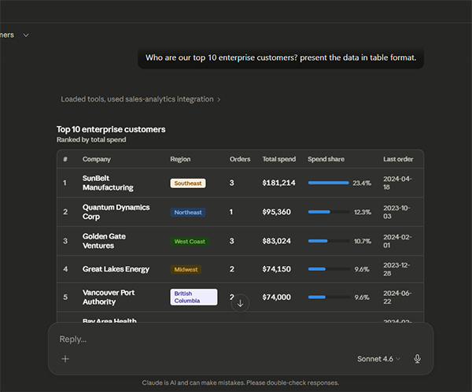
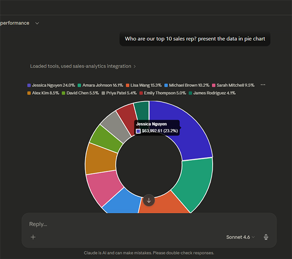
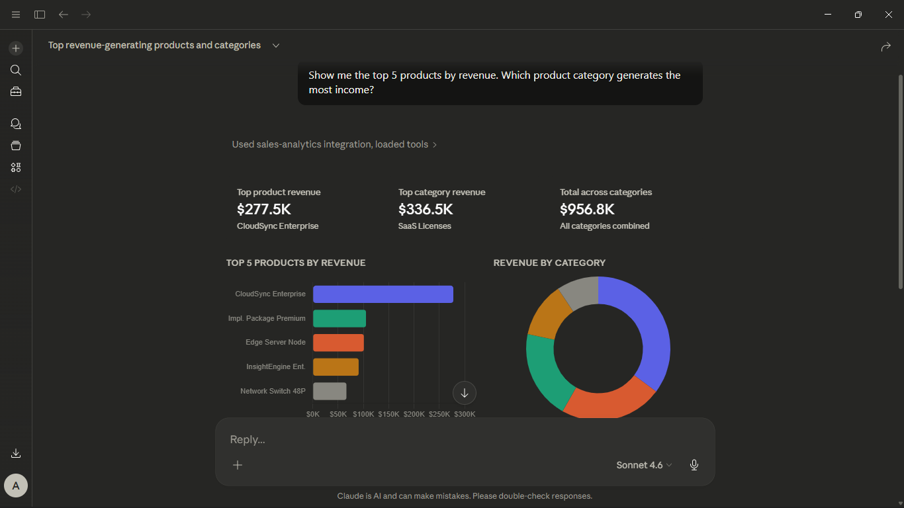
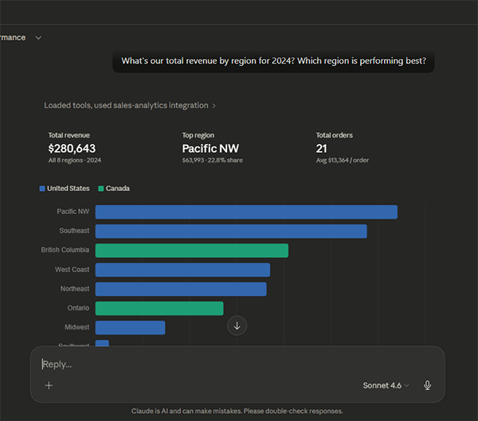

# 🔧 MCP Sales Analytics Server

A **Model Context Protocol (MCP)** server that enables Large Language Models (LLMs) to
directly query and analyze a PostgreSQL sales database through natural language conversations.

Built with Python, the official MCP SDK, psycopg3, and Docker.


---

## 🧩 The Challenge

Business teams rely on sales data to make strategic decisions — identifying top customers,
tracking revenue trends, monitoring sales rep performance, and spotting growth opportunities.
However, accessing this data typically requires:

- **SQL expertise** — writing complex queries with joins, aggregations, and filters
- **Database access** — navigating credentials, connections, and security policies
- **Context switching** — moving between BI tools, spreadsheets, and communication platforms
- **Rigid dashboards** — pre-built reports that can't answer ad-hoc questions

This creates a bottleneck where business stakeholders depend on data analysts or engineers
for every new question, slowing down decision-making.

---

## 💡 The Solution

This project implements a **Model Context Protocol (MCP) server** that acts as a bridge between an LLM and a PostgreSQL database. It allows users to ask questions about sales data in **plain English** and get accurate, real-time answers.

Using this tool, users can ask questions like "Who are our top 10 enterprise customers?" or "Tell me everything about [Customer], including their order history." in plain english and get Real Time results and analysis directly from a chatbot.

---

### How It Works

1. **User** asks a question in Claude Desktop (e.g., *"Show me Q1 revenue by region"*)
2. **Claude** interprets the question and selects the appropriate MCP tool
3. **MCP Server** receives the tool call, executes a parameterized SQL query
4. **PostgreSQL** returns the results
5. **MCP Server** formats the data and sends it back to Claude
6. **Claude** presents the results in a clear, conversational format

---

## ✨ Features

- 🗣️ **Natural Language Queries** — Ask questions in plain English
- 🔧 **12 Pre-built Tools** — Revenue analysis, customer insights, rep performance, and more
- 🛡️ **Read-Only Safety** — Database connection enforces SELECT-only queries
- 🔒 **SQL Injection Prevention** — All queries use parameterized placeholders
- ⏱️ **Query Timeout** — 30-second limit prevents runaway queries
- 🏊 **Connection Pooling** — Efficient database connection management
- 🐳 **Docker Compose** — One-command setup for the entire stack
- 📊 **Realistic Sample Data** — 30 customers, 51 orders, 12 reps, 22 products
- 🧠 **Schema-as-Resource** — LLM has access to full database documentation

---

## 📋 Prerequisites

- **[Docker Desktop](https://www.docker.com/products/docker-desktop/)** (v4.0+)
- **[Claude Desktop](https://claude.ai/download)** (v0.7+)

---

## 🚀 Installation

### Docker (Recommended)

The fastest way to get everything running. Docker handles PostgreSQL, data seeding,
and the MCP server automatically.

```bash
  git clone https://github.com/sumarditjhai-sys/mcpserver.git
  cd mcpserver
  docker compose --env-file .env.docker up --build -d
```
To Connect the MCP server with Claude, Open Claude Desktop go to "Settings" then "Developer" then "Edit Config". Replace "claude_desktop_config.json" contents with 

```bash
{
  "mcpServers": {
    "sales-analytics": {
      "command": "docker",
      "args": [
        "exec",
        "-i",
        "mcp-sales-server",
        "python",
        "-m",
        "mcp_sales.server"
      ]
    }
  }
}
```
Restart Claude, and you are ready to chat. Try sending this chat to Claude:

"Show me revenue by region for 2024"
"How is Sarah Mitchell performing against her quota?"
"Show me the top 5 products by revenue. Which product category generates the most income?"
"What's our total revenue by region for 2024? Which region is performing best?"
"Show me the top 5 products by revenue. Which product category generates the most income?"

---

<div align="center">
  
</div>

<div align="center">
  
</div>

<div align="center">
  
</div>

<div align="center">
  
</div>
---
